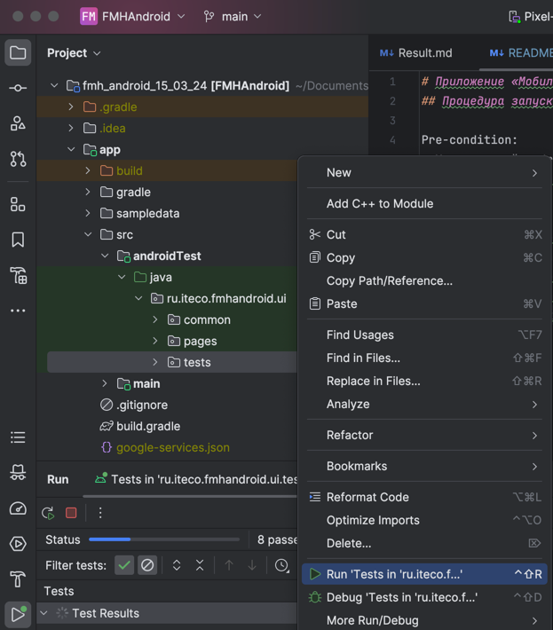

# Приложение «Мобильный хоспис»
## Процедура запуска автотестов:

Pre-condition:
- Устаноленный android studio с эмулятором на API 29. 
- На эмуляторе отключена анимация.

Steps:
1. Клонировать проект - https://github.com/Fredyshar/my_diplom.git
2. Открыть его в Android Studio
3. Запустить настроенный эмулятор
4. На папке с тестами - app/src/androidTest/java/ru/iteco/fmhandroid/ui/tests 
нажать правой кнопкой и выбрать запуск всех тестов.
